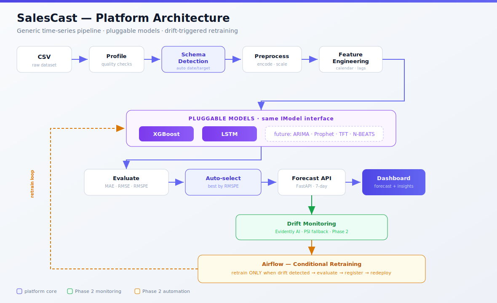
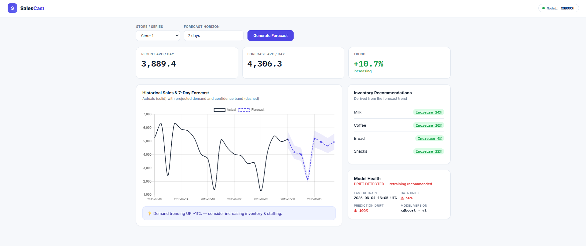
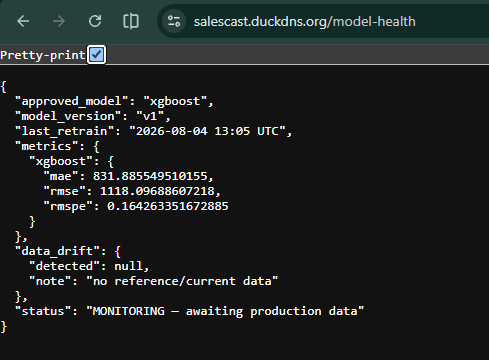
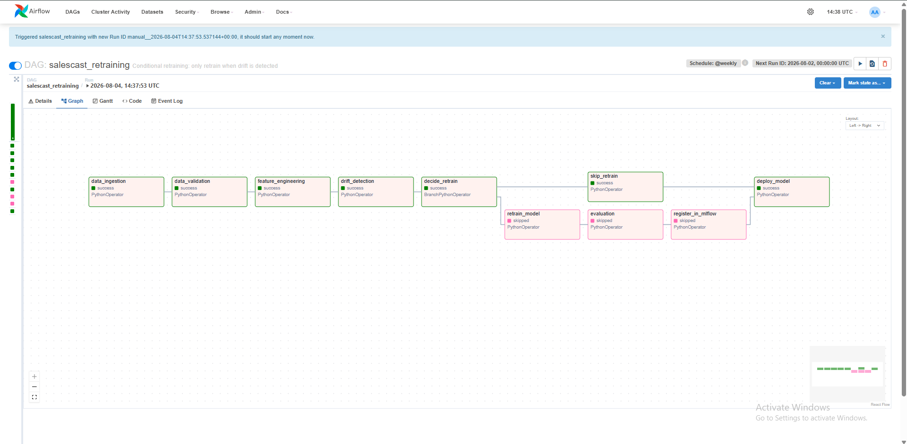
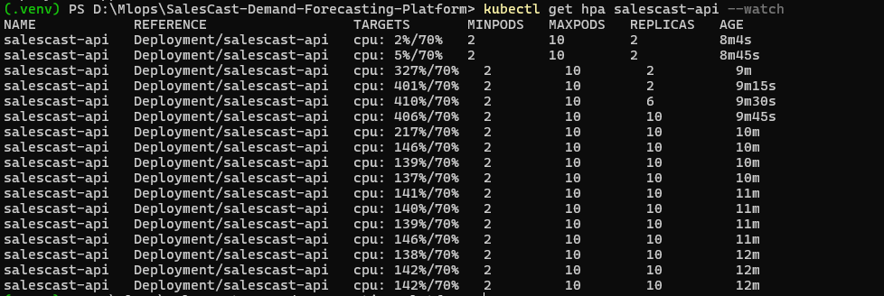
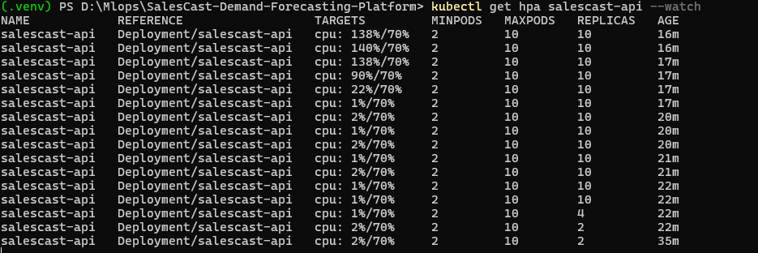

<div align="center">

# 📈 SalesCast — Demand Forecasting Platform

**A reusable, model-agnostic forecasting platform** — not a single-model demo.
It detects a dataset's structure automatically, engineers features, trains and
compares multiple models, auto-selects the best, serves 7-day forecasts with
business recommendations, **monitors data drift in production**, and
**retrains only when drift is detected**, with every run tracked and every model
version gated on beating the current champion.

[](https://github.com/omarhatem44/SalesCast-Demand-Forecasting-Platform/actions/workflows/ci.yml)
[](https://python.org)
[](https://xgboost.ai)
[](https://tensorflow.org)
[](https://fastapi.tiangolo.com)
[](https://evidentlyai.com)
[](https://airflow.apache.org)
[](https://mlflow.org)
[](https://docker.com)
[](https://kubernetes.io)
[](https://salescast.duckdns.org)

**🌐 Live demo: [salescast.duckdns.org](https://salescast.duckdns.org)**

</div>

---

## 📑 Table of Contents
- [Why this is a platform, not a project](#-why-this-is-a-platform-not-a-project)
- [Screenshots](#-screenshots)
- [Architecture & design decisions](#-architecture--design-decisions)
- [Phase 1 — the forecasting MVP](#-phase-1--the-forecasting-mvp)
- [Phase 2 — monitoring, tracking & automated retraining](#-phase-2--monitoring-tracking--automated-retraining)
- [Phase 3 — Kubernetes & autoscaling](#-phase-3--kubernetes--autoscaling)
- [Testing & CI](#-testing--ci)
- [What is running and what is not](#-what-is-running-and-what-is-not)
- [Quick start](#-quick-start)
- [Project structure](#-project-structure)
- [Engineering notes](#-engineering-notes)
- [Roadmap](#-roadmap)

---

## 🎯 Why this is a platform, not a project

Most forecasting projects hardcode one dataset's column names and train one model.
SalesCast is built around **SOLID interfaces** so every stage is replaceable, and the
pipeline works on **any** business time-series with minimal configuration:



**Rossmann retail sales is the dataset it was built and validated on.** Nothing in the
pipeline is Rossmann-specific: the schema detector infers the date, target, group and
feature roles from the file itself. That claim is tested rather than asserted —
`test_detects_schema_with_no_retail_column_names` runs the detector against a frame
with no retail vocabulary anywhere (`timestamp`, `load_mw`, `temperature_c`) and
asserts it still finds the right columns, flags the target as a low-confidence guess,
and says so in its notes.

Running it on a second real domain end to end is future work, not a claim made here.

---

## 📸 Screenshots

**Forecasting dashboard (live):** store selector, 7-day forecast with confidence band,
KPIs, inventory recommendations.



**Model Health panel (drift monitoring):** last retrain, data drift, prediction drift,
model version read from the MLflow registry.



**Airflow retraining DAG (conditional branching):** the graph view showing retraining
skipped when no drift is detected.



**Autoscaling under load.** The HPA scaling out as CPU passes its 70% target, and the
deliberate five-minute hold before scaling back in.





---

## 🏗️ Architecture & design decisions

Every major stage is an abstract interface (`abc.ABC`) with interchangeable
implementations, wired via a config-driven registry. **New models or preprocessors
can be added without modifying existing code** (Open/Closed Principle).

| Interface | Responsibility | Implementation |
|---|---|---|
| `IDataLoader` | load raw data | `CsvLoader`, `DataFrameLoader` |
| `IDataProfiler` | statistics + quality flags | `BasicProfiler` |
| `ISchemaDetector` | auto-detect date/target/group/features | `HeuristicSchemaDetector` |
| `IPreprocessor` | clean / encode / scale (schema-driven) | `GenericPreprocessor` |
| `IFeatureEngineer` | calendar / lag / rolling features | `CalendarFeatureEngineer` |
| `IWindowBuilder` | sliding windows for sequences | `SlidingWindowBuilder` |
| `IModel` | fit / predict / save / load | `XGBoostForecaster`, `LSTMForecaster` |
| `IModelEvaluator` | MAE / RMSE / RMSPE | `StandardEvaluator` |
| `IModelSelector` | pick the best model | `BestByMetricSelector` |
| `IForecaster` | serve N-day forecast + insight | `Forecaster` |
| `IMonitor` | drift detection | `EvidentlyDriftMonitor` (+ PSI fallback) |
| `ITracker` | experiment tracking + model registry | `MLflowTracker`, `NullTracker` |
| `IRetrainer` | retrain decision | Airflow branching DAG |

**Why interfaces?** So the platform can grow. Adding Prophet later is:

```python
@register_model("prophet")
class ProphetForecaster(IModel): ...
# instantly available to the pipeline, selector, and API — zero other changes
```

That is asserted in the test suite, not just claimed:
`test_new_model_registers_without_touching_the_pipeline` registers a model at runtime
and checks the pipeline can resolve it.

---

## 🚀 Phase 1 — the forecasting MVP

Generic pipeline · auto schema detection · XGBoost + LSTM · auto-selection ·
FastAPI · retail-analytics dashboard · Docker · HTTPS.

**Modeling — honest, not dogmatic.** The platform trains both models on the same
windows and the same chronological split, evaluates on MAE/RMSE/RMSPE, and
auto-selects the winner. On Rossmann, **XGBoost wins (RMSPE 0.162 vs 0.234)** and the
system reports that rather than forcing the deep model.

That comparison only means something because both models are given a fair run.
`LSTMForecaster` standardises its own target internally: the window builder hands
every model raw values in the thousands, and trees are scale-invariant while a network
trained on those values under MSE starts at a loss in the tens of millions and never
leaves zero. Before that fix the LSTM scored RMSPE 0.996 — which is not a model losing,
it is a model predicting nothing. A regression test now pins it below 0.6 so the
comparison cannot silently become meaningless again.

**Dashboard.** A retail-analytics interface (not just a chart): store selector,
historical sales, 7-day forecast with confidence band, KPIs, and inventory
recommendations derived from the forecast trend.

> Inventory Recommendation (from forecast trend):
> Milk → increase 14% · Coffee → increase 10% · Bread → increase 4%

### API

| Endpoint | Description |
|---|---|
| `GET /health` | liveness |
| `GET /model-info` | approved model, metrics, detected schema |
| `POST /forecast` | 7-day forecast + business insight for a series |
| `GET /model-health` | drift status + model metadata |
| `POST /model-health` | drift check against posted recent data |

---

## 🔁 Phase 2 — monitoring, tracking & automated retraining

### Drift monitoring

The **Model Health** panel on the dashboard shows, in real time:

- **Last retrain** timestamp
- **Data drift** status + share
- **Prediction drift** status
- **Model version**, read from the MLflow registry's `Production` alias

Backed by `EvidentlyDriftMonitor` with a PSI fallback — see
[Engineering notes](#-engineering-notes). The `/model-health` endpoint compares recent
data against the saved training reference and returns *HEALTHY*,
*DRIFT DETECTED — retraining recommended*, or *MONITORING*.

### Experiment tracking & model registry

Every training run logs its parameters and per-model metrics to MLflow, and the
selected model is registered as a new version. Promotion is **champion/challenger**,
not automatic:

```
[eval] xgboost  MAE=824.34 RMSE=1105.24 RMSPE=0.1621
[eval] lstm     MAE=2000.16 RMSE=2559.29 RMSPE=0.2335
[select] best model: xgboost
[registry] version 1 promoted to Production
```

A later run that trains a worse model still gets registered, but does not take the
alias:

```
[registry] version 2 held as challenger (champion rmspe=0.1621)
```

That gate is the reason to have a registry at all — without it, "registered" just
means "saved somewhere else as well". The behaviour is covered by
`test_registry_promotes_the_first_model_then_gates_a_worse_one`, which registers a
good model, a worse one, and a better one, and asserts the alias moves only on merit.

Tracking sits behind `ITracker` with a `NullTracker` fallback, so a clean clone trains
with no MLflow server present and training never fails because a side-channel is down.

```bash
mlflow ui --backend-store-uri sqlite:///mlflow.db     # Model training → salescast
```

### Airflow retraining DAG

`salescast_retraining` — a DAG with **conditional retraining**:

```
data_ingestion → data_validation → feature_engineering → drift_detection → decide_retrain
                                                                                │
                                          ┌─────────────────────────────────────┴───────────┐
                                     drift detected                                      no drift
                                          │                                                  │
                                    retrain_model                                       skip_retrain
                                          │                                                  │
                                     evaluation                                              │
                                          │                                                  │
                                  register_in_mlflow                                         │
                                          │                                                  │
                                          └──────────────────────┬───────────────────────────┘
                                                            deploy_model
```

**Key feature:** a `BranchPythonOperator` retrains **only when drift is detected**,
otherwise it skips straight to keeping the current model. This avoids needless
retraining and demonstrates conditional orchestration — not a linear script.

Registration and promotion happen inside `TrainingPipeline`, so a model goes through
the same gate whether training was started by this DAG or by hand. The DAG's
`register_in_mlflow` task reads the result and **fails the run if no registration
happened**, rather than reporting success for a step that silently no-opped.

**Deployment note:** Airflow runs **locally** (Docker Compose) for orchestration and
demos; the production instance serves only the API. This mirrors real setups where
orchestration is separate from the serving layer.

**Run it:**

```bash
cd airflow
docker compose build
docker compose up airflow-init      # one-time DB + admin user
docker compose up -d
# open http://localhost:8080  (admin / admin)
```

---

## ☸️ Phase 3 — Kubernetes & autoscaling

The manifests in `k8s/` — Deployment, Service, HorizontalPodAutoscaler, Kustomization —
have been applied to a live cluster and the autoscaler exercised under real load. Full
runbook in [`DEPLOY.md`](DEPLOY.md).

```bash
kubectl apply -k k8s/
kubectl get pods,svc,hpa
```

**Load hits `/forecast`, not `/health`.** A liveness endpoint returns a constant and
burns no CPU, so hammering it would never move the autoscaler — the load generator in
`k8s/loadtest.yaml` posts real history and triggers preprocessing, feature engineering,
window building and inference, which is the work the service actually does.

**Scaling out.** Idle at 2% of the 70% CPU target with 2 replicas. Under load CPU
reaches 410% and the HPA scales 2 → 6 → 10 within about 45 seconds.

**The ceiling is visible on purpose.** At `maxReplicas: 10` the service stabilises
around 140% of target rather than dropping below 70% — it is doing everything it is
allowed to do and the load still exceeds it. That is the honest reading: the limit is
real, not hidden behind an oversized ceiling.

**Scaling back in is deliberately slow.** When load stops, CPU falls to 1% within
seconds but replicas hold at 10 for five minutes before stepping down 10 → 4 → 2. That
is `scaleDown.stabilizationWindowSeconds: 300`, chosen because cycling pods on a brief
lull costs more than running a spare. `scaleUp` uses a 30-second window for the
opposite reason.

Two operational details worth knowing, both in `DEPLOY.md`: the HPA reports
`<unknown>/70%` forever unless metrics-server is installed, and CPU **requests** must be
set on the container or there is nothing for the autoscaler to divide against.

---

## 🧪 Testing & CI

`tests/test_platform.py` holds interface smoke tests: not model accuracy, but the
contracts the platform rests on. Every implementation is checked against its ABC, the
registry is checked for the Open/Closed property, schema detection is checked on both
retail and non-retail data, drift detection is checked to separate a stable
distribution from a shifted one, and the registry gate is checked to defend a champion.

```bash
pytest -q
```

GitHub Actions runs four jobs on every push and pull request:

| Job | What it protects |
|---|---|
| **Tests** | the interface contracts and regression tests |
| **Training smoke test** | trains end to end and fails if the selected model's RMSPE looks broken — a green unit suite does not prove the pipeline still trains |
| **Docker images build** | both images build from a clean checkout, so the image can never quietly depend on an uncommitted file |
| **Kubernetes manifests** | `kubeconform -strict` against the manifests in `k8s/` |

---

## 📍 What is running and what is not

Claims in a README are cheap, so here is the split.

| | Status |
|---|---|
| FastAPI service, dashboard, HTTPS | running |
| Docker (training + serving images) | built, and rebuilt from clean in CI |
| MLflow tracking and registry with gated promotion | working, local SQLite backend |
| Evidently drift monitoring + PSI fallback | working, surfaced in the dashboard |
| Airflow conditional retraining DAG | runs locally |
| Kubernetes (Deployment, Service, HPA) | applied to a live cluster; manifests CI-validated |
| Autoscaling | demonstrated: 2 → 10 replicas under load, back to 2 after the 300s window |
| AWS | **not deployed** — the live demo runs on a single host |
| `deploy_model` task in the DAG | **a stub** — it logs intent; the retrained model is not rolled out automatically |
| Drift input to the DAG | **simulated** for the demo; it resamples the reference rather than reading a live production window |
| MLflow backend | **single-machine SQLite** — fine for one process, wrong for a cluster |

---

## ⚡ Quick start

```bash
pip install -r requirements.txt

# drop the real Rossmann train.csv in data/ (or use the included sample)
python main.py                      # detects schema, trains both models, auto-selects

uvicorn api.main:app --host 0.0.0.0 --port 8000
# open http://localhost:8000
```

**Docker (serving image):**

```bash
python main.py                                            # artifacts/ must exist first
docker build -f Dockerfile.serve -t salescast-serve .
docker run -d --name salescast -p 8000:8000 salescast-serve
```

The serving image loads the trained model from `artifacts/`, which is gitignored — so
train before building, or the container starts and fails its readiness probe.

**Kubernetes:** see [`DEPLOY.md`](DEPLOY.md) for the full path, including metrics-server
and the load test that exercises the HPA.

---

## 📁 Project structure

```
salescast/
├── src/forecasting/
│   ├── interfaces/contracts.py          # all ABCs + data contracts
│   ├── core/registry.py                 # pluggable-model registry
│   ├── implementations/
│   │   ├── loaders/        profilers/   preprocessors/
│   │   ├── models/         evaluators/  monitors/
│   │   └── tracking/mlflow_tracker.py   # MLflow tracking + gated registry
│   └── pipeline/
│       ├── training.py                  # end-to-end training orchestrator
│       ├── forecaster.py                # loads approved model, 7-day forecast
│       └── health.py                    # model-health service
├── api/main.py                          # FastAPI (forecast + health endpoints)
├── dashboard/index.html                 # retail-analytics UI + health panel
├── airflow/
│   ├── dags/salescast_retraining_dag.py # conditional retraining DAG
│   ├── docker-compose.yaml              # local Airflow (LocalExecutor + Postgres)
│   └── Dockerfile                       # Airflow image + platform deps
├── k8s/                                 # deployment, service, HPA, kustomization
│   └── loadtest.yaml                    # HPA load generator (applied manually)
├── .github/workflows/ci.yml             # tests, train smoke, docker, manifests
├── config/config.yaml                   # data path, horizon, models, mlflow, overrides
├── tests/test_platform.py               # interface smoke tests
├── conftest.py                          # puts src/ on sys.path for pytest
├── forecast-payload.json                # sample /forecast body (60 rows of history)
├── main.py · Dockerfile · Dockerfile.serve · DEPLOY.md
└── requirements.txt · requirements-serve.txt · requirements-monitoring.txt
```

---

## 🔧 Engineering notes

Things that were not obvious until something broke.

**Drift monitoring survives its own dependency.** Evidently changed its report API
between 0.6 and 0.7. `EvidentlyDriftMonitor` tries both paths and falls back to a
hand-written PSI monitor if neither imports, because a monitoring panel that goes down
when a library upgrades is worse than one that degrades to a simpler metric.

**A group column is not a column with an ID-ish name.** Detection originally returned
the first column matching an ID name hint, which meant a low-cardinality categorical
like `StoreType` could be picked as the series key on a single-series dataset — and the
pipeline then filters on it, silently dropping most of the data. It now tests whether
grouping actually makes `(group, date)` unique, and returns `None` when dates are
already unique.

**Scale matters for one model and not the other.** See the LSTM note in
[Phase 1](#-phase-1--the-forecasting-mvp): comparing a scale-sensitive model against a
scale-invariant one on unscaled targets is not a comparison.

**The MLflow file store has no model registry.** `file://` gives you runs and silently
no versions, so tracking defaults to `sqlite:///mlflow.db`. Models are logged as
`pyfunc` so a registered version is genuinely loadable
(`mlflow.pyfunc.load_model("models:/salescast-forecaster@Production")`), not just a
file parked next to a run.

**A forecast needs more history than `lookback + horizon`.** The rolling features drop
their leading rows, so a request with 25 rows fails on a 14-day lookback and 7-day
horizon even though the arithmetic says it should fit. About 40 rows is the real floor;
`forecast-payload.json` carries 60.

**An autoscaler cannot scale on a metric nobody publishes.** The HPA divides observed
CPU by the container's CPU **request**, so a Deployment with no `resources.requests`
autoscales on nothing at all — and without metrics-server the HPA reports
`<unknown>/70%` indefinitely rather than erroring.

---

## 🗺️ Roadmap

**✅ Phase 1 — Production MVP**
Generic pipeline · auto schema detection · XGBoost + LSTM · auto-selection ·
FastAPI · dashboard · Docker · HTTPS deployment.

**✅ Phase 2 — Monitoring, tracking & automation**
Evidently/PSI drift monitoring · live model-health panel · Airflow retraining DAG with
conditional (drift-triggered) retraining · MLflow tracking and model registry with
champion/challenger promotion · test suite and CI.

**✅ Phase 3 — Kubernetes & autoscaling**
Deployment, Service and HPA manifests validated in CI, applied to a live cluster, and
exercised under load: 2 → 10 replicas at 410% of target, back to 2 after the
five-minute stabilisation window.

**🚧 Phase 4 — Production hardening**
Managed cluster on AWS/EKS · replace the DAG's simulated drift input with a real
production window · wire `deploy_model` to an actual rollout · move MLflow to a
server-backed store so more than one process can write to it · slim the serving image,
which is currently larger than it needs to be.

**🔮 Phase 5 — Self-serve platform**
CSV upload → automatic profiling → schema detection → preprocessing → feature
engineering → model selection → forecast, hands-free. Multi-domain validation
(energy, logistics, restaurants, supply chain) and an AutoML-style workflow.

---

## 👤 Author

**Omar Hatem** — ML / MLOps Engineer · Cairo, Egypt
[GitHub](https://github.com/omarhatem44) · [LinkedIn](https://www.linkedin.com/in/omar-hatem-mohamed-355ba4369/)

---

<div align="center">

*A reusable, model-agnostic demand-forecasting platform with drift monitoring and
automated retraining — architected for extension, delivered in phases.*

</div>